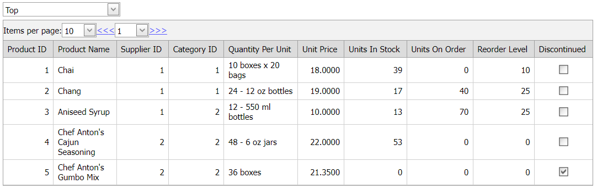

<!-- default badges list -->

[](https://supportcenter.devexpress.com/ticket/details/E1738)
[](https://docs.devexpress.com/GeneralInformation/403183)
<!-- default badges end -->
# Grid View for ASP.NET Web Forms - How to create a custom pager and display a page size item
<!-- run online -->
**[[Run Online]](https://codecentral.devexpress.com/e1738/)**
<!-- run online end -->

This example demonstrates how to create a pager template and add editors to the template to implement a custom [pager](https://docs.devexpress.com/AspNet/3676/components/grid-view/visual-elements/pager). The template also contains a combo box editor that emulates a page size item.



## Overview

Follow the steps below to create a custom pager:

1. Specify the grid's [PagerBar](https://docs.devexpress.com/AspNet/DevExpress.Web.GridViewTemplates.PagerBar) property and add editors to the template.

2. Use a combo box editor to emulate a page size item. Populate the editor with items in the editor's server-side `Init` event handler.

3. On the client, handle the editor's [SelectedIndexChanged](https://docs.devexpress.com/AspNet/js-ASPxClientComboBox.SelectedIndexChanged) event. In the handler, send a callback to the grid and pass the editor's value as a parameter.

    ```aspx
    <dx:ASPxComboBox ID="cbRecords" runat="server" ToolTip="Items Per Page"
        ValueType="System.Int32" OnInit="cbRecords_Init">
        <ClientSideEvents SelectedIndexChanged="function (s, e) { grid.PerformCallback(s.GetValue()); }"
            Init="function (s, e) { s.SetValue(grid.cpPageSize); }" />
    </dx:ASPxComboBox>
    ```

4. Handle the grid's [CustomCallback](https://docs.devexpress.com/AspNet/DevExpress.Web.ASPxGridView.CustomCallback) event. In the handler, assign the editor's value to the grid's [PageSize](https://docs.devexpress.com/AspNet/DevExpress.Web.ASPxGridViewPagerSettings.PageSize) property and save it to the corresponding session.

    ```cs
    protected void grid_CustomCallback(object sender, ASPxGridViewCustomCallbackEventArgs e) {
        ASPxGridView grid = sender as ASPxGridView;
        int newPageSize;
        if (e != null) {
            if (!int.TryParse(e.Parameters, out newPageSize)) return;
            grid.SettingsPager.PageSize = newPageSize;
            Session["GridCurrentPageSize"] = newPageSize;
        }
    }
    ```

## Files to Review

* [Default.aspx](./CS/WebSite/Default.aspx) (VB: [Default.aspx](./VB/WebSite/Default.aspx))
* [Default.aspx.cs](./CS/WebSite/Default.aspx.cs) (VB: [Default.aspx.vb](./VB/WebSite/Default.aspx.vb))

## Documentation

* [Pager](https://docs.devexpress.com/AspNet/3676/components/grid-view/visual-elements/pager)

* [Grid View Templates](https://docs.devexpress.com/AspNet/3718/components/grid-view/concepts/templates)

## More Examples

* [Grid View for ASP.NET Web Forms - Use a status bar template to create a custom pager](https://github.com/DevExpress-Examples/create-the-custom-pager-in-the-status-bar-template-e358)

* [Grid View for ASP.NET Web Forms - Create a custom pager and a page size item at runtime](https://github.com/DevExpress-Examples/create-aspxgridview-with-a-custom-pager-and-the-selecting-a-page-size-feature-at-runtime-e4802)
